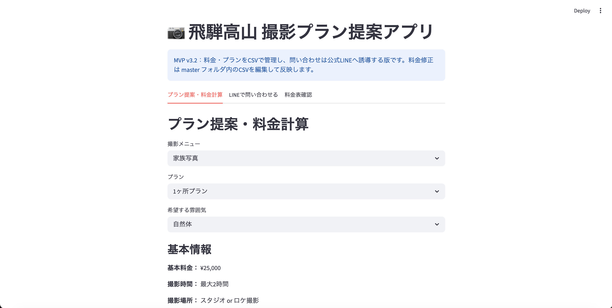

# camera-ai-mvp

## デモURL

以下のURLからアプリを確認できます。

https://camera-ai-mvp.streamlit.app/

## デモ動画

アプリの操作イメージは以下の動画で確認できます。

https://youtu.be/sBBLNCqqa5o

## 概要

カメラマン向けの撮影プラン提案アプリです。

ユーザーが希望する撮影内容や条件を入力すると、撮影プランの候補や料金の目安を確認できます。

## 画面イメージ



## 作成した目的

身近なカメラ事業の課題を題材に、PythonとStreamlitを使って実用的なWebアプリを作るために作成しました。

学習用のサンプルではなく、実際の問い合わせ導線やプラン提案を想定したMVPです。

## 主な機能

- 撮影プランの提案
- 料金の目安表示
- 公式LINEへの案内
- サンプルメッセージの表示
- 問い合わせ内容のCSVダウンロード

## 使用技術

- Python
- Streamlit
- pandas
- Git / GitHub

## 起動方法

このリポジトリを自分のパソコンにコピーします。

```bash
git clone https://github.com/python-mvp-lab/camera-ai-mvp.git
```

フォルダに移動します。

```bash
cd camera-ai-mvp
```

必要なライブラリをインストールします。

```bash
pip install -r requirements.txt
```

アプリを起動します。

```bash
streamlit run app.py
```

## Dockerでの起動方法

Dockerを使う場合は、以下のコマンドでアプリを起動できます。

```bash
docker build -t camera-ai-mvp .
```

```bash
docker run --rm -p 8501:8501 camera-ai-mvp
```

ブラウザで以下を開きます。

```text
http://localhost:8501
```

## 工夫した点

- 初めて利用する人でも分かりやすいように、入力から結果表示までの流れをシンプルにしました。
- 実在するカメラ事業を想定し、問い合わせや公式LINEにつながる導線を意識しました。
- 個人情報を含めず、ポートフォリオとして見せられる内容にしています。
- 将来的に機能追加しやすいように、データファイルや設定ファイルを分けています。
- 入力内容をCSVとして出力できるようにし、問い合わせ内容を後から確認しやすくしました。

## 今後の改善予定

- 入力内容のCSV保存
- 画面キャプチャの追加
- Docker対応
- デモ動画の作成
- FastAPIを使ったAPI化
- AIによる撮影相談機能の追加

## 注意事項

このアプリは学習・ポートフォリオ目的で作成したMVPです。  
実際の料金やサービス内容は、運用前に確認・調整が必要です。